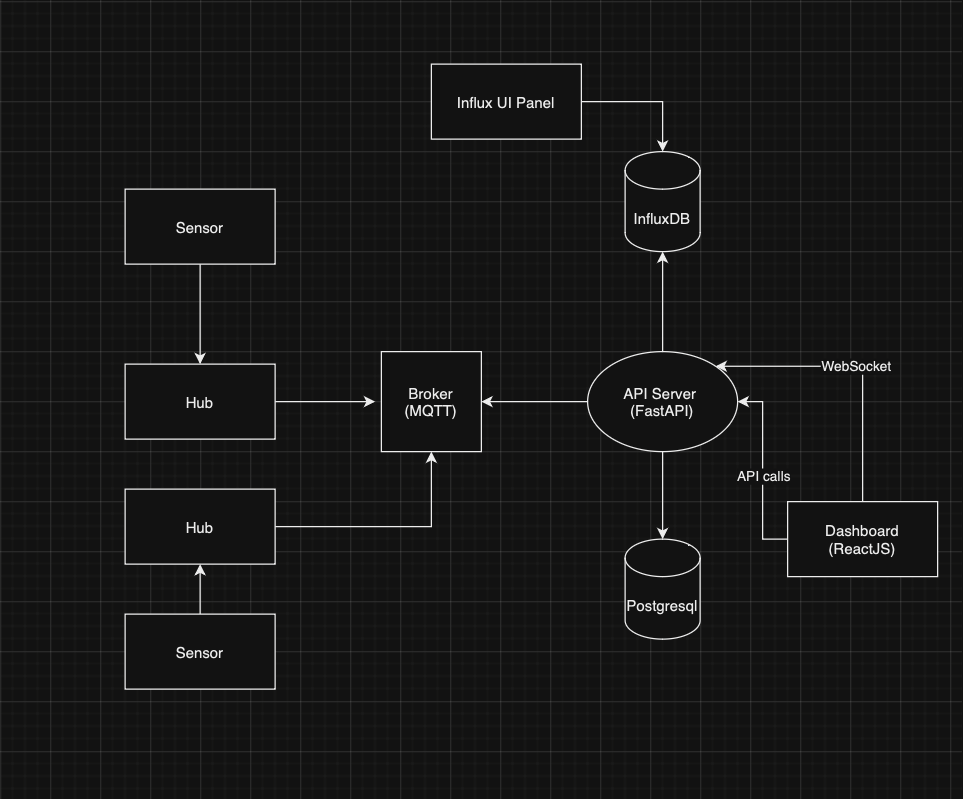

# IoT Sensor Data Collection and Visualization System

## Table of Contents
1. [Overview](#overview)
2. [System Architecture](#system-architecture)
3. [Setup Instructions](#setup-instructions)
    - Installing Dependencies and Running the System
5. [Documentation](#documentation)
    - Technologies Used
    - Code Documentation
    - Decision Documentation

## Overview

This project simulates the collection of temperature and humidity data from various sensors. The data is aggregated by hubs, sent to a server via MQTT, stored in InfluxDB and PostgreSQL, and displayed using a React-based web dashboard.

## System Architecture

The system is composed of the following key components:
- **Simulated Sensors**: Generate random temperature and humidity data.
- **Hubs**: Collect data from sensors and publish it to an MQTT broker.
- **MQTT Broker**: Facilitates communication between hubs and the server.
- **Server**: Subscribes to MQTT topics, processes incoming data, and stores it in InfluxDB.
- **Database**: InfluxDB to store time-series data and PostgreSQL to manage user data and authentication.
- **Data Visualization**: A React-based dashboard to visualize the collected sensor data.



## Setup Instructions

### Installing Dependencies and Running the System

1. **Backend (Python and PostgreSQL and MQTT Broker and InfluxDB)**
    ```sh
    docker-compose up
    ```

2. **Frontend (React)**
    ```sh
    cd dashboard
    npm install
    npm start
    ```

## Documentation

### Technologies Used

- **Python**: For simulating sensors and hubs, and for the FastAPI web server.
- **MQTT (Mosquitto)**: For data communication.
- **FastAPI**: For developing the web server.
- **InfluxDB**: Ideal for time-series data storage and you can access to its UI dashboard via [localhost](http://localhost:8086/).
- **PostgreSQL**: Robust database for storing user authentication data.
- **React**: Preferred for its component-based architecture and dynamic UI capabilities.

### Code Documentation

- **Hub Simulator (Python)**:
    - Simulates sensors generating random data.
    - Publishes data to MQTT topics.

- **FastAPI Server**:
    - Subscribes to MQTT topics.
    - Processes and stores data in InfluxDB.
    - Provides REST endpoints to fetch data for visualization and hub ids.
    - User registration and authentication using PostgreSQL.
    - You can access documentation and schemas via [docs](http://localhost:8000/docs#/).
    - And there is a postman API Collection that you can import and use.
    - Provides a web-socket api to stream hubs data real-time.

- **React Dashboard**:
    - Fetches sensor data and hub ids from the FastAPI server.
    - Visualizes data using Chart.js (react-chartjs-2).
    - Visualizes Real-Time Chart using web socket and you can choose between them.
    - Advanced Data Filtering by date and time and hub ids and you can have all your hub data in just one chart.
    - Provides user login interface.
    - Uses Material UI to enhance the UI.
    - You can access it via [localhost](http://localhost:3000/) after npm start.

### Decision Documentation

- **Technology Choices**:
    - **MQTT**: Chosen for its lightweight, reliable messaging suited for IoT scenarios.
    - **FastAPI**: Selected for its fast performance, ease of use, and modern Python support.
    - **InfluxDB**: Ideal for time-series data storage with efficient querying.
    - **PostgreSQL**: Robust and reliable for user data and authentication.
    - **React**: Preferred for its component-based architecture and dynamic UI capabilities.